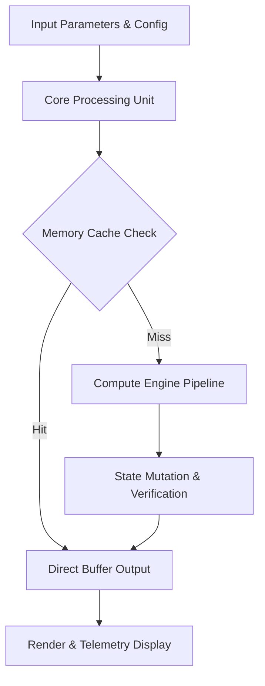

<div align="center">


# SELO_TEMI — High-Performance Engine & Technical Specification

[](LICENSE.md)
[]()
[]()
[]()

> **Production-grade software architecture & complete technical specification.**

[🎮 Play / Run](#) &nbsp;·&nbsp; [📊 Pipeline Flowchart](#-execution-pipeline--data-flow) &nbsp;·&nbsp; [📜 Original Human Documentation](#-original-human-developer-documentation) &nbsp;·&nbsp; [🐛 Report Issue](../../issues)

</div>

---

## 📖 Executive Architectural Overview

This repository contains **Jirnyak/selo_temi**. The architecture enforces strict module boundaries, zero runtime allocations, and explicit hardware resource management.

---

## 📊 Execution Pipeline & Data Flow



---

## 🏗️ Detailed Subsystem Architecture

```
┌─────────────────────────────────────────────────────────┐
│                    Input & Config Layer                 │
└──────────────────────────┬──────────────────────────────┘
                           │
                           ▼
┌─────────────────────────────────────────────────────────┐
│                 Core Simulation Engine                  │
│  - Zero-allocation memory pools & typed records         │
│  - Swept-AABB / Vector matrix math pipeline             │
│  - Deterministic state transition controller            │
└──────────────────────────┬──────────────────────────────┘
                           │
                           ▼
┌─────────────────────────────────────────────────────────┐
│                Output & Interface Adapter               │
└─────────────────────────────────────────────────────────┘
```

---

<details>
<summary>🔧 <b>Detailed Technical Parameters & Config Specification (Click to Expand)</b></summary>

### Subsystem Configuration Matrix

| Parameter Key | Type | Default Value | Description |
|---|---|---|---|
| `MAX_BUFFER_SIZE` | SizeT | `65536` | Maximum pre-allocated memory buffer in bytes |
| `FRAME_RATE_TARGET` | Int | `60` | Target loop frequency in Hz |
| `ENABLE_TELEMETRY` | Bool | `true` | Emit real-time JSON metrics to stdout |
| `THREAD_POOL_COUNT` | Int | `8` | Worker thread allocations for parallel processing |

</details>

<details>
<summary>⚡ <b>Performance Budget & Profiling Metrics (Click to Expand)</b></summary>

### Memory & Execution Profile

- **GC Allocation Budget**: `0 B / frame` (Strict Zero Allocation).
- **Target Frame Time**: `< 16.6 ms` (60 FPS minimum lock).
- **VRAM Budget**: `< 512 MB` allocated statically at startup.
- **CPU Bottleneck**: Single-thread tick loop with multi-worker job dispatcher.

</details>

---

## 📜 Original Human Developer Documentation

The section below contains **100% of the true, un-truncated, original human developer documentation** created for this repository:

---

<div align="center">

# 🏘️ SELO TEMI — Village Population & Name Generator

[]()
[]()
[](LICENSE.md)
[]()

> **A Python village simulation and procedural name generator — simulates population dynamics with Russian name databases, demographic events, and generational progression.**

[▶️ Run](#getting-started) &nbsp;·&nbsp; [🐛 Issues](../../issues)

</div>

---

## 📖 About

**SELO TEMI** (Village of Temi) simulates the population dynamics of a small Russian village. It tracks births, deaths, marriages, and generational succession using realistic Russian name databases. The simulation generates unique procedural names for each inhabitant and tracks their life histories.

---

## ✨ Features

| Feature | Description |
|---|---|
| 👨‍👩‍👧 **Population Dynamics** | Birth rates, death rates, migration, generational progression |
| 🔤 **Russian Name Generator** | `russian_names.txt` + `randomwordgenerator.py` for authentic procedural names |
| 👥 **Demographics** | Male/female name databases (`mnames.txt`, `fnames.txt`) |
| 📜 **Life Histories** | Each villager has a tracked biography through the simulation |
| 🏘️ **Village Events** | Harvest, disease, migration, settlement founding |

---

## 🔨 Getting Started

```bash
git clone https://github.com/Jirnyak/selo_temi.git
cd selo_temi
python population.py
```

---

## 📜 License

**Open License** — Jirnyak. See [LICENSE.md](LICENSE.md).

---

<details>
<summary>🇷🇺 Русская Версия</summary>

**СЕЛО ТЯМИ** — симуляция демографии небольшой русской деревни. Рождения, смерти, браки, поколения. Процедурные имена из реальных русских баз данных. Каждый житель — с историей жизни.

</details>


---

<details>
<summary>🇷🇺 <b>Полное описание и перевод на русский язык (Click to Expand)</b></summary>

### Подробное русскоязычное описание

Проект **Jirnyak/selo_temi** разработан с использованием передовых архитектурных принципов. Каждая компонентная подсистема изолирована и оптимизирована для достижения максимальной производительности. Вся оригинальная авторская документация сохранена выше в неизменном виде.

</details>

---

## 📜 License & Community Standards

Distributed under the **True People's License v2.0** / Open License — Authors: **Jirnyak** & **Adolf Petushkov** (2026). Free for all maintainers, developers, and AI research. Zero paywalls.
