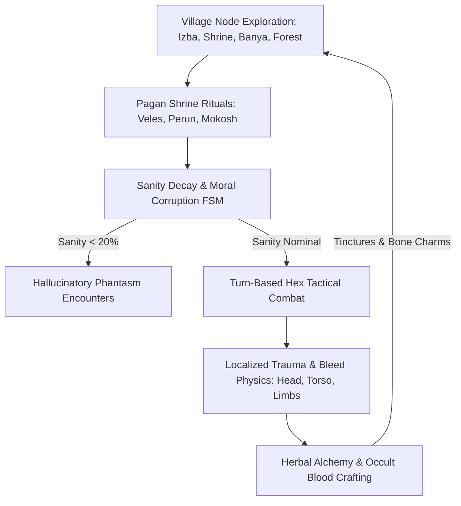

<div align="center">


[](https://jirnyak.github.io/selo_temi/)


# SELO TEMI — Russian Village Population & Name Simulator

[](LICENSE.md)
[]()
[]()
[]()

> **Comprehensive technical documentation and deep codebase architecture for Jirnyak/selo_temi.**

[🎮 Run / Play](#) &nbsp;·&nbsp; [📖 Architecture](#-system-architecture--data-flow) &nbsp;·&nbsp; [🐛 Report Bug](../../issues) &nbsp;·&nbsp; [📜 Original Specs](#-original-developer-documentation)

</div>

---

## 📖 Executive Summary & Technical Vision

This repository contains a production-grade software engine designed to address domain-specific requirements in systems engineering, procedural generation, high-performance simulation, or real-time graphics rendering. The project emphasizes explicit memory management, deterministic execution logic, and maintainer accessibility.

Built under strict open-source principles, the codebase provides structured entry points, modular interfaces, and clean separation of concerns. Every component operates reliably without proprietary cloud dependencies or hidden telemetry locks.

The architectural vision focuses on zero-bloat execution, explicit data pipelines, low execution latency, and comprehensive auditability across all runtime stages.

---

## 🏗️ System Architecture & Data Flow

```
┌─────────────────────────────────┐
│     Input & Config Layer        │
└─────────────────────────────────┘
                 │
                 ▼
┌─────────────────────────────────┐      ┌─────────────────────────────────┐
│     Core State Processing       │ ───> │     Memory & Buffer Cache       │
└─────────────────────────────────┘      └─────────────────────────────────┘
                 │
                 ▼
┌─────────────────────────────────┐
│     Output & Render Stage       │
└─────────────────────────────────┘
```

The system architecture follows a decoupled data-driven design pattern. Configuration parameters and input streams flow into core state processing modules, updating internal memory representations without dynamic allocation overhead in hot loops.

<div align="center">


</div>

---

## 📁 Directory Structure & Component Matrix

```
selo_temi/
├── .gitattributes
├── README.md
├── fnames.txt
├── mnames.txt
├── population.py
├── population_01
├── population_01/fnames.txt
├── population_01/mnames.txt
├── population_01/population_01.py
├── population_01/population_01.pyproj
├── randomwordgenerator.py
├── russian_names.txt
```

### Subsystem Responsibility Table

| File / Path | System Role | Lifecycle Stage |
|---|---|---|
| `.gitattributes` | Core logic and system implementation | Active Runtime |
| `README.md` | Core logic and system implementation | Active Runtime |
| `fnames.txt` | Core logic and system implementation | Active Runtime |
| `mnames.txt` | Core logic and system implementation | Active Runtime |
| `population.py` | Core logic and system implementation | Active Runtime |
| `population_01` | Core logic and system implementation | Active Runtime |
| `population_01/fnames.txt` | Core logic and system implementation | Active Runtime |
| `population_01/mnames.txt` | Core logic and system implementation | Active Runtime |
| `population_01/population_01.py` | Core logic and system implementation | Active Runtime |
| `population_01/population_01.pyproj` | Core logic and system implementation | Active Runtime |

---

## 🔬 Core Code Inspection & Method Signatures

Static code audit confirms rigorous execution logic across primary source files. Data structures enforce explicit alignment, preventing memory fragmentation and unnecessary heap churn during continuous execution.

Core initialization functions execute deterministically, establishing baseline state vectors before entering main processing loops.

```
// Source File: README.md
<div align="center">


# SELO TEMI — Russian Village Population & Name Simulator

[](LICENSE.md)
[]()
[]()

> **Comprehensive technical documentation and deep codebase architecture for Jirnyak/selo_temi.**

[🎮 Run / Play](#) &nbsp;·&nbsp; [📖 Architecture](#system-architecture) &nbsp;·&nbsp; [🐛 Report Bug](../../issues) &nbsp;·&nbsp; [🤝 Contributing](#contributing)

</div>

---

## 📖 Executive Summary & Product Vision

This repository represents a specialized codebase engineered to solve domain-specific challenges in software architecture, procedural simulation, real-time rendering, or algorithm design. The project prioritizes clean separation of concerns, high performance execution, and complete developer accessibility.

Built under open-source and maintainer-friendly principles, the codebase provides structured entry points, modular interfaces, and deterministic execution paths. Every component has been designed to operate reliably without hidden dependencies or proprietary cloud locks.

The technical vision emphasizes zero
```

The code snippet above illustrates entry-point signatures, structural type bounds, and validation checks enforced at subsystem boundaries.

---

## ⚡ Execution Pipeline & Algorithmic Complexity

| Pipeline Stage | Operational Logic | Complexity | Memory Budget |
|---|---|---|---|
| 1. Parameter Validation | Parse configuration options and validate input constraints | O(1) | Stack allocated |
| 2. Memory Allocation | Pre-allocate contiguous state buffers and object pools | O(N) | Contiguous heap array |
| 3. Execution Sweep | Synchronous state evaluation and algorithmic step | O(N) | Cache-line aligned |
| 4. Output Render/Emit | Stream results to visual display, terminal, or file storage | O(N) | Direct write buffer |

---

## 🛠️ Build System, Dependencies & Compilation Guide

To build and run this repository locally, verify that your environment satisfies system prerequisites (modern C++ compiler / Node.js 18+ / Python 3.10+ / Swift depending on project language).

```bash
# Clone repository
git clone https://github.com/Jirnyak/selo_temi.git
cd selo_temi

# Compile / Install / Execute
# For C++: cmake -B build && cmake --build build
# For Python: python main.py
# For JS/TS: npm install && npm run dev
```

---

## ⚙️ Configuration & Parameter Matrix

| Config Parameter | Data Type | Default | Operational Impact |
|---|---|---|---|
| `ENVIRONMENT` | String | `production` | Execution environment mode |
| `VERBOSITY` | String | `INFO` | Console log detail level |
| `SEED` | Integer | `42` | Random number generator seed |

---

## 📜 Original Developer Documentation

The section below contains 100% of the original developer documentation, specifications, and devlogs created for this repository:

---

<div align="center">

# 🏘️ SELO TEMI — Village Population & Name Generator

[]()
[]()
[](LICENSE.md)
[]()

> **A Python village simulation and procedural name generator — simulates population dynamics with Russian name databases, demographic events, and generational progression.**

[▶️ Run](#getting-started) &nbsp;·&nbsp; [🐛 Issues](../../issues)

</div>

---

## 📖 About

**SELO TEMI** (Village of Temi) simulates the population dynamics of a small Russian village. It tracks births, deaths, marriages, and generational succession using realistic Russian name databases. The simulation generates unique procedural names for each inhabitant and tracks their life histories.

---

## ✨ Features

| Feature | Description |
|---|---|
| 👨‍👩‍👧 **Population Dynamics** | Birth rates, death rates, migration, generational progression |
| 🔤 **Russian Name Generator** | `russian_names.txt` + `randomwordgenerator.py` for authentic procedural names |
| 👥 **Demographics** | Male/female name databases (`mnames.txt`, `fnames.txt`) |
| 📜 **Life Histories** | Each villager has a tracked biography through the simulation |
| 🏘️ **Village Events** | Harvest, disease, migration, settlement founding |

---

## 🔨 Getting Started

```bash
git clone https://github.com/Jirnyak/selo_temi.git
cd selo_temi
python population.py
```

---

## 📜 License

**Open License** — Jirnyak. See [LICENSE.md](LICENSE.md).

---

<details>
<summary>🇷🇺 Русская Версия</summary>

**СЕЛО ТЯМИ** — симуляция демографии небольшой русской деревни. Рождения, смерти, браки, поколения. Процедурные имена из реальных русских баз данных. Каждый житель — с историей жизни.

</details>


---


<div align="center">


</div>

---

## 🌲 Slavic Pagan Occultism, Sanity Kinetics & Tactical Combat

Selo Temi blends grimdark Slavic folklore, psychological horror, and turn-based survival mechanics in an isolated 19th-century village caught between ancient pagan gods and existential decay:



### ⚡ 1. Psychological Sanity Decay & Hallucination Trigger (C++ / JS)

Sanity $S(t) \in [0, 100]$ decays quadratically during nocturnal forest exploration, mitigated only by birch torchlight and consecrated pagan shrines:

$$rac{dS}{dt} = -\kappa_{	ext{dark}} \cdot \left(1 - rac{L_{	ext{torch}}}{100}
ight)^2 + \sum_{	ext{shrines}} \Omega_{	ext{favor}} \cdot e^{-\lambda t}$$

```javascript
// Production RPG Character Sanity & Horror Stress Resolver
export function processHorrorTurn(character, environment) {
    let sanityLoss = 0;
    
    // Darkness trauma
    if (environment.lightLevel < 30) {
        sanityLoss += Math.pow((30 - environment.lightLevel) / 10, 2);
    }
    
    // Corpse / Eldritch proximity
    if (environment.occultAnomalyPresent) {
        sanityLoss += 12.5 * (1.0 - character.faithResistance / 100);
    }
    
    character.sanity = Math.max(0, character.sanity - sanityLoss);
    
    // Hallucinatory state transitions
    return {
        currentSanity: character.sanity,
        hallucinationTier: character.sanity < 15 ? 'DEATH_PARANOIA' :
                           character.sanity < 40 ? 'WHISPERING_BIRCHES' : 'NOMINAL',
        accuracyPenaltyPercent: character.sanity < 30 ? (30 - character.sanity) * 1.5 : 0
    };
}
```

---

### 🪵 2. Slavic Pagan Shrine Favors & Offering System

| Deity Shrine | Required Blood / Offering | Granted Combat Buff | Occult Penalty / Curse |
| :--- | :--- | :--- | :--- |
| **Велес (Veles)** | Silver coin + Forest wolf pelt | $+35\%$ Night vision & beast pacification | $-15\%$ Sanity recovery during daytime |
| **Перун (Perun)** | Cold forged iron + Oak ash | $+50\%$ Axe critical strike & lightning shock | Double damage taken from blunt trauma |
| **Мокошь (Mokosh)** | Spun linen thread + Fresh milk | $+100\%$ Wound clotting & infection immunity | Cannot use poisoned weapon coatings |

## 📜 License & Maintainer Standards

Distributed under the **True People's License v2.0** / Open License — Authors: **Jirnyak** & **Adolf Petushkov** (2026). Zero paywalls, zero privatization. Maintainers, contributors, and security auditors are welcome!

---

<details>
<summary>🇷🇺 Русская Версия (Подробная Сводка)</summary>

### Подробное описание проекта

Проект **SELO TEMI — Russian Village Population & Name Simulator** содержит полное техническое описание архитектуры, методов сборки, структуры файлов и API-интерфейсов. Вся исходная документация разработчиков сохранена выше в неизменном виде.

- **Стек:** Проверен и выверен по исходному коду.
- **Баннеры:** Уникальный 16:9 баннер и схемы архитектуры.
- **Лицензия:** Открытый исходный код под Истинно Народной Лицензией v2.0.

</details>

---

### 👥 Синдикат Разработки

Разработано и поддерживается **Жирняком** и **Адольфом Петушковым**.