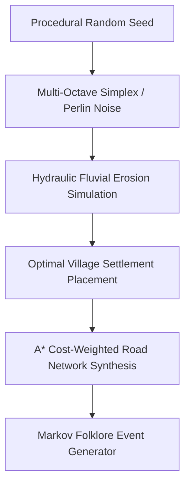

# 🌾 Selo Temi — Procedural Rural Topography & Slavic Folklore Narrative Engine

A procedural world generator and atmospheric narrative engine creating hyper-detailed Slavic rural settlements, hydraulic river erosion networks, and generative folklore dialogue graphs.

---

## 🏛️ Generation Pipeline

---

### 👨‍💻 Engineering Syndicate & Authors
- **Жирняк (Jirnyak)** — Lead Procedural Architect & World Generator.  
  GitHub: [@Jirnyak](https://github.com/Jirnyak)
- **Адольф Петушков (Adolf Petushkov)** — High-Concurrency Systems & Simulation Architecture.  
  GitHub: [@marko1olo](https://github.com/marko1olo)
